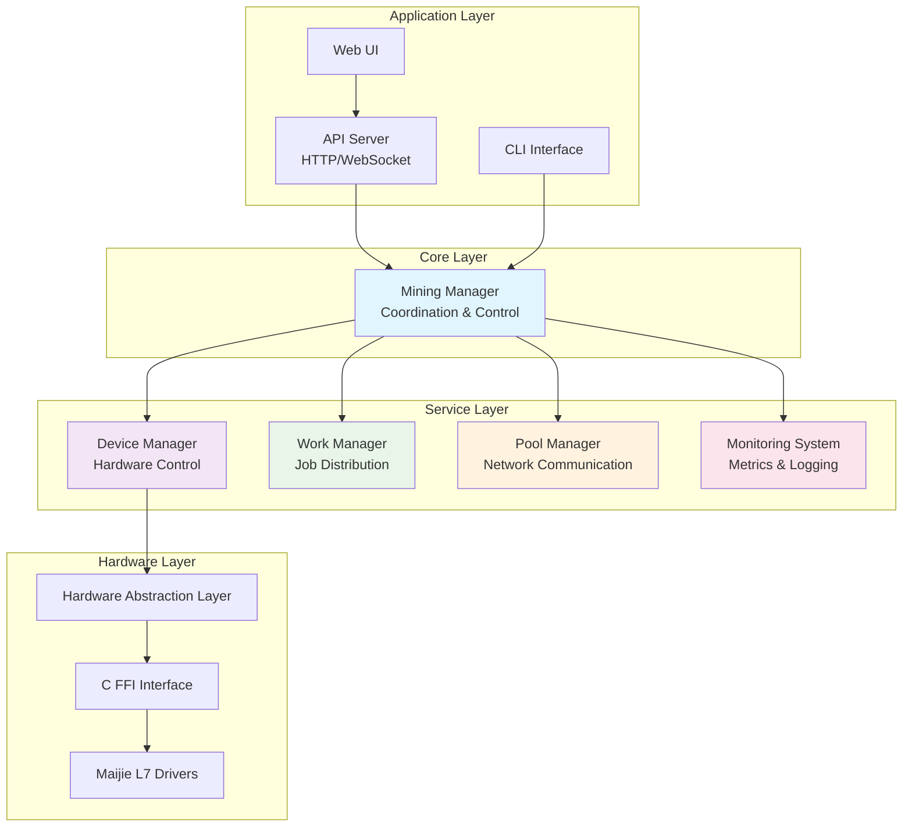
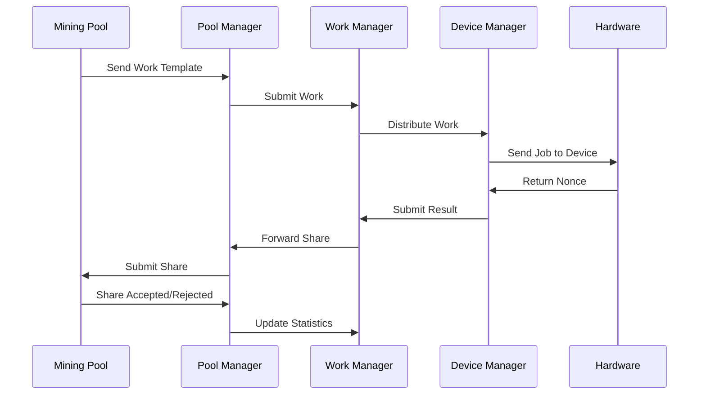
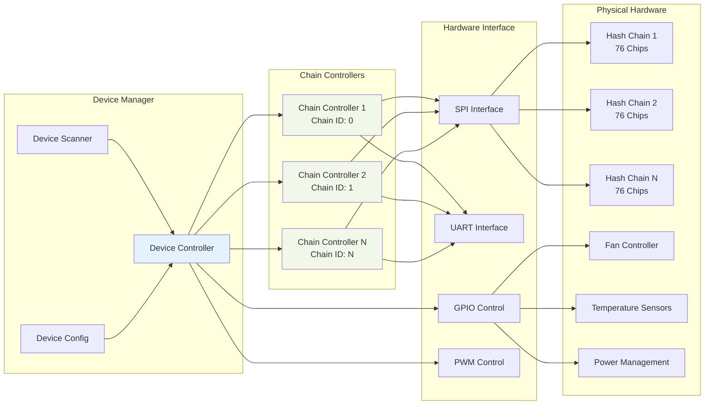
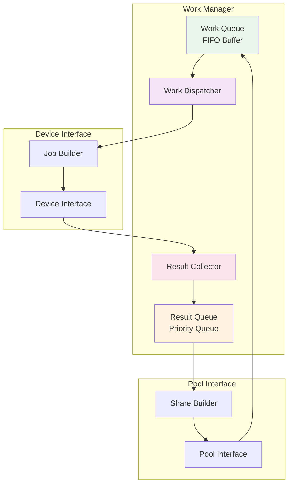
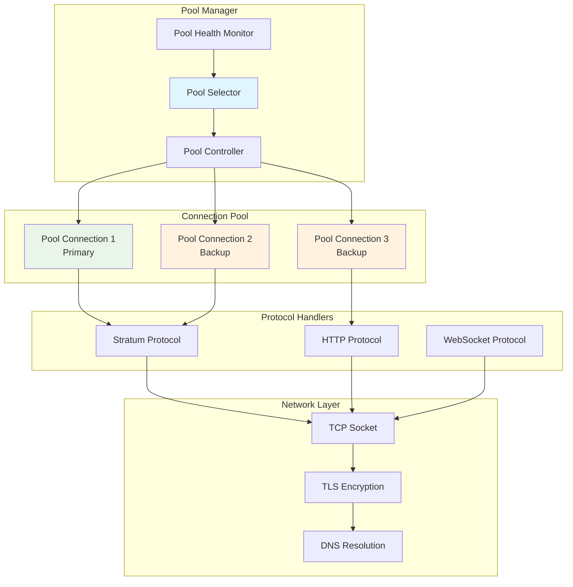
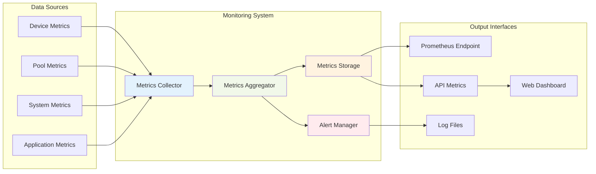
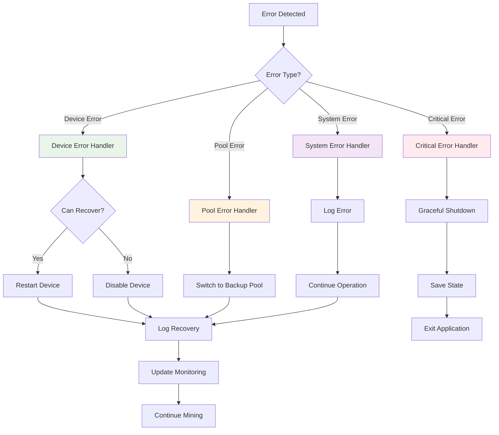
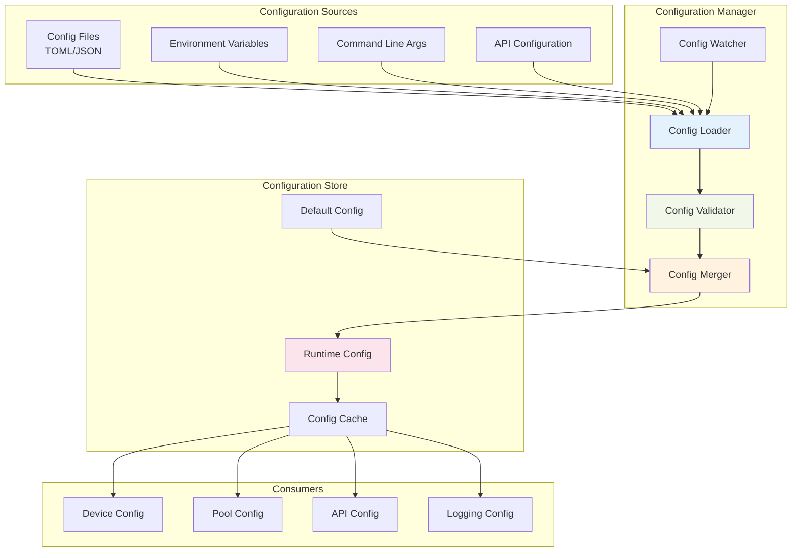
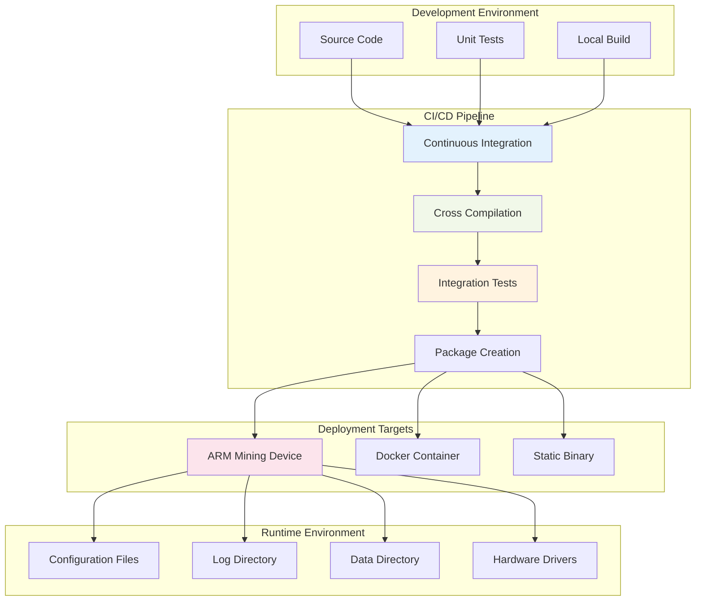

# CGMiner-RS 架构图

## 系统整体架构

```mermaid
graph TB
    subgraph "Application Layer"
        API[API Server<br/>HTTP/WebSocket]
        CLI[CLI Interface]
        WEB[Web UI]
    end
    
    subgraph "Core Layer"
        MM[Mining Manager<br/>Coordination & Control]
    end
    
    subgraph "Service Layer"
        DM[Device Manager<br/>Hardware Control]
        WM[Work Manager<br/>Job Distribution]
        PM[Pool Manager<br/>Network Communication]
        MS[Monitoring System<br/>Metrics & Logging]
    end
    
    subgraph "Hardware Layer"
        HAL[Hardware Abstraction Layer]
        FFI[C FFI Interface]
        DRIVER[Maijie L7 Drivers]
    end
    
    API --> MM
    CLI --> MM
    WEB --> API
    
    MM --> DM
    MM --> WM
    MM --> PM
    MM --> MS
    
    DM --> HAL
    HAL --> FFI
    FFI --> DRIVER
    
    style MM fill:#e1f5fe
    style DM fill:#f3e5f5
    style WM fill:#e8f5e8
    style PM fill:#fff3e0
    style MS fill:#fce4ec
```

## 数据流架构

```mermaid
sequenceDiagram
    participant Pool as Mining Pool
    participant PM as Pool Manager
    participant WM as Work Manager
    participant DM as Device Manager
    participant HW as Hardware
    
    Pool->>PM: Send Work Template
    PM->>WM: Submit Work
    WM->>DM: Distribute Work
    DM->>HW: Send Job to Device
    
    HW->>DM: Return Nonce
    DM->>WM: Submit Result
    WM->>PM: Forward Share
    PM->>Pool: Submit Share
    
    Pool->>PM: Share Accepted/Rejected
    PM->>WM: Update Statistics
```

## 设备管理架构

```mermaid
graph LR
    subgraph "Device Manager"
        DC[Device Controller]
        DS[Device Scanner]
        DM_CONFIG[Device Config]
    end
    
    subgraph "Chain Controllers"
        CC1[Chain Controller 1<br/>Chain ID: 0]
        CC2[Chain Controller 2<br/>Chain ID: 1]
        CC3[Chain Controller N<br/>Chain ID: N]
    end
    
    subgraph "Hardware Interface"
        SPI[SPI Interface]
        UART[UART Interface]
        GPIO[GPIO Control]
        PWM[PWM Control]
    end
    
    subgraph "Physical Hardware"
        CHAIN1[Hash Chain 1<br/>76 Chips]
        CHAIN2[Hash Chain 2<br/>76 Chips]
        CHAINN[Hash Chain N<br/>76 Chips]
        FAN[Fan Controller]
        TEMP[Temperature Sensors]
        POWER[Power Management]
    end
    
    DC --> CC1
    DC --> CC2
    DC --> CC3
    DS --> DC
    DM_CONFIG --> DC
    
    CC1 --> SPI
    CC2 --> SPI
    CC3 --> SPI
    
    CC1 --> UART
    CC2 --> UART
    CC3 --> UART
    
    DC --> GPIO
    DC --> PWM
    
    SPI --> CHAIN1
    SPI --> CHAIN2
    SPI --> CHAINN
    
    GPIO --> FAN
    GPIO --> TEMP
    GPIO --> POWER
    
    style DC fill:#e3f2fd
    style CC1 fill:#f1f8e9
    style CC2 fill:#f1f8e9
    style CC3 fill:#f1f8e9
```

## 工作队列管理

```mermaid
graph TD
    subgraph "Work Manager"
        WQ[Work Queue<br/>FIFO Buffer]
        RQ[Result Queue<br/>Priority Queue]
        WD[Work Dispatcher]
        RC[Result Collector]
    end
    
    subgraph "Pool Interface"
        PI[Pool Interface]
        SB[Share Builder]
    end
    
    subgraph "Device Interface"
        DI[Device Interface]
        JB[Job Builder]
    end
    
    PI --> WQ
    WQ --> WD
    WD --> JB
    JB --> DI
    
    DI --> RC
    RC --> RQ
    RQ --> SB
    SB --> PI
    
    style WQ fill:#e8f5e8
    style RQ fill:#fff3e0
    style WD fill:#f3e5f5
    style RC fill:#fce4ec
```

## 矿池连接架构

```mermaid
graph TB
    subgraph "Pool Manager"
        PS[Pool Selector]
        PC[Pool Controller]
        PH[Pool Health Monitor]
    end
    
    subgraph "Connection Pool"
        CONN1[Pool Connection 1<br/>Primary]
        CONN2[Pool Connection 2<br/>Backup]
        CONN3[Pool Connection 3<br/>Backup]
    end
    
    subgraph "Protocol Handlers"
        STRATUM[Stratum Protocol]
        HTTP[HTTP Protocol]
        WS[WebSocket Protocol]
    end
    
    subgraph "Network Layer"
        TCP[TCP Socket]
        TLS[TLS Encryption]
        DNS[DNS Resolution]
    end
    
    PS --> PC
    PC --> CONN1
    PC --> CONN2
    PC --> CONN3
    PH --> PS
    
    CONN1 --> STRATUM
    CONN2 --> STRATUM
    CONN3 --> HTTP
    
    STRATUM --> TCP
    HTTP --> TCP
    WS --> TCP
    
    TCP --> TLS
    TLS --> DNS
    
    style PS fill:#e1f5fe
    style CONN1 fill:#e8f5e8
    style CONN2 fill:#fff3e0
    style CONN3 fill:#fff3e0
```

## 监控系统架构

```mermaid
graph LR
    subgraph "Data Sources"
        DEV[Device Metrics]
        POOL[Pool Metrics]
        SYS[System Metrics]
        APP[Application Metrics]
    end
    
    subgraph "Monitoring System"
        MC[Metrics Collector]
        MA[Metrics Aggregator]
        MS_STORE[Metrics Storage]
        ALERT[Alert Manager]
    end
    
    subgraph "Output Interfaces"
        PROM[Prometheus Endpoint]
        LOG[Log Files]
        API_METRICS[API Metrics]
        DASHBOARD[Web Dashboard]
    end
    
    DEV --> MC
    POOL --> MC
    SYS --> MC
    APP --> MC
    
    MC --> MA
    MA --> MS_STORE
    MA --> ALERT
    
    MS_STORE --> PROM
    MS_STORE --> API_METRICS
    ALERT --> LOG
    API_METRICS --> DASHBOARD
    
    style MC fill:#e3f2fd
    style MA fill:#f1f8e9
    style MS_STORE fill:#fff3e0
    style ALERT fill:#ffebee
```

## 错误处理流程

```mermaid
flowchart TD
    START[Error Detected] --> TYPE{Error Type?}
    
    TYPE -->|Device Error| DEV_HANDLE[Device Error Handler]
    TYPE -->|Pool Error| POOL_HANDLE[Pool Error Handler]
    TYPE -->|System Error| SYS_HANDLE[System Error Handler]
    TYPE -->|Critical Error| CRIT_HANDLE[Critical Error Handler]
    
    DEV_HANDLE --> DEV_RECOVER{Can Recover?}
    DEV_RECOVER -->|Yes| DEV_RESTART[Restart Device]
    DEV_RECOVER -->|No| DEV_DISABLE[Disable Device]
    
    POOL_HANDLE --> POOL_SWITCH[Switch to Backup Pool]
    
    SYS_HANDLE --> SYS_LOG[Log Error]
    SYS_LOG --> SYS_CONTINUE[Continue Operation]
    
    CRIT_HANDLE --> SHUTDOWN[Graceful Shutdown]
    
    DEV_RESTART --> LOG[Log Recovery]
    DEV_DISABLE --> LOG
    POOL_SWITCH --> LOG
    SYS_CONTINUE --> LOG
    
    LOG --> MONITOR[Update Monitoring]
    MONITOR --> END[Continue Mining]
    
    SHUTDOWN --> SAVE[Save State]
    SAVE --> EXIT[Exit Application]
    
    style DEV_HANDLE fill:#e8f5e8
    style POOL_HANDLE fill:#fff3e0
    style SYS_HANDLE fill:#f3e5f5
    style CRIT_HANDLE fill:#ffebee
```

## 配置管理架构

```mermaid
graph TB
    subgraph "Configuration Sources"
        FILE[Config Files<br/>TOML/JSON]
        ENV[Environment Variables]
        CLI_ARGS[Command Line Args]
        API_CONFIG[API Configuration]
    end
    
    subgraph "Configuration Manager"
        LOADER[Config Loader]
        VALIDATOR[Config Validator]
        MERGER[Config Merger]
        WATCHER[Config Watcher]
    end
    
    subgraph "Configuration Store"
        RUNTIME[Runtime Config]
        DEFAULT[Default Config]
        CACHE[Config Cache]
    end
    
    subgraph "Consumers"
        DEVICE_CONFIG[Device Config]
        POOL_CONFIG[Pool Config]
        API_CONFIG_CONSUMER[API Config]
        LOG_CONFIG[Logging Config]
    end
    
    FILE --> LOADER
    ENV --> LOADER
    CLI_ARGS --> LOADER
    API_CONFIG --> LOADER
    
    LOADER --> VALIDATOR
    VALIDATOR --> MERGER
    MERGER --> RUNTIME
    
    DEFAULT --> MERGER
    RUNTIME --> CACHE
    
    WATCHER --> LOADER
    
    CACHE --> DEVICE_CONFIG
    CACHE --> POOL_CONFIG
    CACHE --> API_CONFIG_CONSUMER
    CACHE --> LOG_CONFIG
    
    style LOADER fill:#e3f2fd
    style VALIDATOR fill:#f1f8e9
    style MERGER fill:#fff3e0
    style RUNTIME fill:#fce4ec
```

## 部署架构

```mermaid
graph TB
    subgraph "Development Environment"
        DEV_CODE[Source Code]
        DEV_TEST[Unit Tests]
        DEV_BUILD[Local Build]
    end
    
    subgraph "CI/CD Pipeline"
        CI[Continuous Integration]
        BUILD[Cross Compilation]
        TEST[Integration Tests]
        PACKAGE[Package Creation]
    end
    
    subgraph "Deployment Targets"
        ARM_DEVICE[ARM Mining Device]
        DOCKER[Docker Container]
        BINARY[Static Binary]
    end
    
    subgraph "Runtime Environment"
        CONFIG[Configuration Files]
        LOGS[Log Directory]
        DATA[Data Directory]
        DRIVERS[Hardware Drivers]
    end
    
    DEV_CODE --> CI
    DEV_TEST --> CI
    DEV_BUILD --> CI
    
    CI --> BUILD
    BUILD --> TEST
    TEST --> PACKAGE
    
    PACKAGE --> ARM_DEVICE
    PACKAGE --> DOCKER
    PACKAGE --> BINARY
    
    ARM_DEVICE --> CONFIG
    ARM_DEVICE --> LOGS
    ARM_DEVICE --> DATA
    ARM_DEVICE --> DRIVERS
    
    style CI fill:#e3f2fd
    style BUILD fill:#f1f8e9
    style TEST fill:#fff3e0
    style ARM_DEVICE fill:#fce4ec
```
